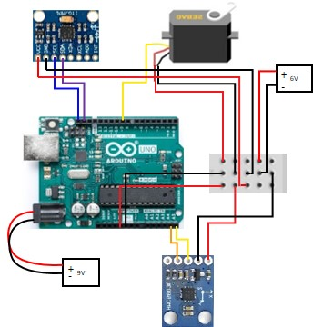

# digital_compass_arduino
The digital compass consists of two sensors, one 360 servo and Arduino uno. Gyro Accelerometer is used to provide the angular speed. Magnetometer is used to get angle with the north. Servo is rotated CW/CCW to adjust the position aligned with north.  Arduino is powered by a 6V battery while servo is powered by a 9V battery. Both sensors are connected to Arduino serially (I2C protocol).

